<div align="center">

<!-- Upload header.svg to your Ayushburman/Ayushburman repo root -->


</div>

---

<div align="center">

[](https://git.io/typing-svg)

</div>

---

```
┌─────────────────────────────────────────────────────────────────────────┐
│  FILE: AJ91789.log          CLEARANCE: PUBLIC          STATUS: PARTIAL  │
│  INTERCEPT DATE: ONGOING    SOURCE: UNKNOWN             DECODED: 73%    │
└─────────────────────────────────────────────────────────────────────────┘
```

**`IDENTITY`**
> Engineer navigating the intersection of Computation, Intelligence, and Systems.
> B.Tech CSE @ Chandigarh University — Batch 2025.
> Self-studying mathematics. Building things that outlast the course.

**`CURRENT OBJECTIVE`**
> GATE 2027 → IIT Madras M.Tech CSE · Target: AIR < 150
> Not grinding. *Constructing a foundation.*

---

## `▸ ACTIVE SYSTEMS`

| MODULE | SIGNAL | NOTES |
|--------|--------|-------|
| `Algorithms & Data Structures` | `████████░░ 80%` | CLRS · Kleinberg · Skiena |
| `Engineering Mathematics` | `██████████ 95%` | LinAlg · Probability · Stats |
| `Machine Learning / CV` | `█████░░░░░ 50%` | In progress |
| `Cybersecurity` | `███░░░░░░░ 30%` | ██████ classified |
| `C / Java / Python` | `██████████ ✓` | Operational |

---

## `▸ REPOSITORIES — SECTOR MAP`

<div align="center">

[](https://github.com/Ayushburman/C-Programming-Full-Course)
[](https://github.com/Ayushburman/I-Think)

[](https://github.com/Ayushburman/JAVA-PROGRAMMING)
[](https://github.com/Ayushburman/Computer-Vision-)

</div>

---

## `▸ SIGNAL LOGS`

<div align="center">


</div>

<div align="center">

[](https://git.io/streak-stats)

</div>

---

## `▸ STACK — TOOLS ON BOARD`

<div align="center">


</div>

---

## `▸ TRANSMISSION CHANNELS`

```
◈  github.com/Ayushburman
◈  @i_ayushburman      [ instagram ]
◈  @ayushburman128     [ x / twitter ]
◈  in/ayushburman      [ linkedin ]
```

---

<div align="center">

<!-- Snake contribution graph — see setup instructions below -->


</div>

---

<div align="center">

```
▀▀▀▀▀▀▀▀▀▀▀▀▀▀▀▀▀▀▀▀▀▀▀▀▀▀▀▀▀▀▀▀▀▀▀▀▀▀▀▀▀▀▀▀▀▀▀▀▀▀▀▀▀▀▀
  END OF TRANSMISSION  ◈  SIGNAL ORIGIN: EARTH
  "the universe computes — i just take notes"
▄▄▄▄▄▄▄▄▄▄▄▄▄▄▄▄▄▄▄▄▄▄▄▄▄▄▄▄▄▄▄▄▄▄▄▄▄▄▄▄▄▄▄▄▄▄▄▄▄▄▄▄▄▄▄
```


</div>
